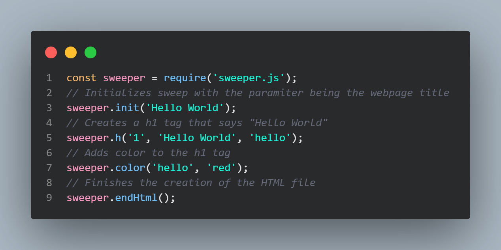
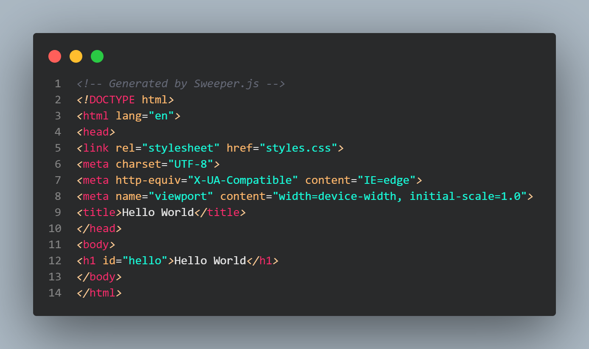
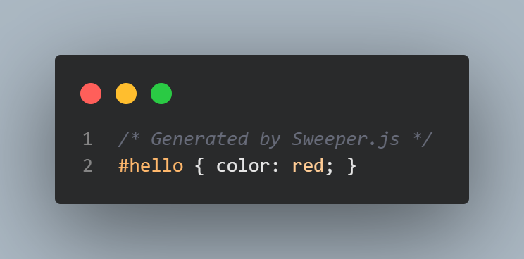

# Sweeper.js

Sweeper.js is a javascript package desigend to convert js to pure web code.

"Sweeper.js is react but yeah" -MrEggoXYZ

https://www.npmjs.com/package/sweeper.js

## How to install
To install Sweeper.js you need to:

1. Create a project folder.
2. In a terminal in the project folder type `npm init -y`.
3. In the same terminal type `npm i sweeper.js`.

## Sweeper.js example

This basic sweeper code ends up outputting, this in a html file

And this in a css file

## Changelog
https://github.com/MrEggoXYZ/Sweeper.js/blob/main/.github/changelog.md

# PLEASE SEE
Sweeper.js is not fully completed and is still in beta, keep in mind that at any moment the syntax and generated code could change
